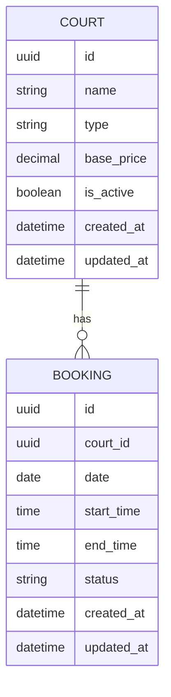
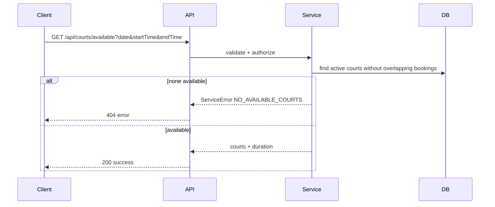

# Technical Design Document: Available Courts API

## 1. Overview

Provide an authenticated API for customers to view available badminton courts within a requested date and time window. A court is considered available if no booking overlaps the requested window. Operating hours are 06:00 to 23:00 local time (Asia/Ho_Chi_Minh). Pricing is fixed per hour for now (no golden hour pricing).

## 2. Requirements

### 2.1 Functional Requirements

- Allow authenticated customers (role = CUSTOMER) to request available courts for a specific date and time window.
- Accept input: `date`, `startTime`, `endTime`.
- Validate that:
  - All fields are present.
  - `startTime` < `endTime`.
  - Time window is within 06:00 to 23:00.
- Return a list of available courts with: `id`, `name`, `type`, `basePrice`, and `durationMinutes`.
- A court is unavailable if any booking overlaps the requested window.
- If no courts are available, return a clear error message.
- Use existing response format from `responseMiddleware`.

### 2.2 Non-Functional Requirements

- Security: require JWT authentication and role authorization (CUSTOMER only).
- Performance: avoid N+1 queries; target minimal DB round trips; p95 latency target = 300ms.
- Observability: log search criteria and result count; emit metrics for searches and empty results.
- Caching: not used for now.

## 3. Technical Design

### 3.1. Codebase Alignment

- Follow existing Express layering: `routes` -> `middleware` -> `controllers` -> `services` -> `repositories/prisma`.
- Reuse shared utilities: `responseMiddleware`, `logger`, `prisma`, and `shared/metrics` patterns.
- Place new route under `backend/src/routes` and new module under `backend/src/modules` to match current structure.
- Use existing JWT auth and role-based authorization middleware (align with current auth flow patterns).

### 3.2. Data Model Changes

Add new models for courts and bookings.



Proposed enums:
- `CourtType`: `SINGLE`, `DOUBLE`
- `BookingStatus`: `PENDING_PAYMENT`, `PAID`, `CANCELLED`

Availability rule (assumption): bookings with status `PENDING_PAYMENT` or `PAID` block availability; `CANCELLED` does not.
Confirmed: bookings with status `PENDING_PAYMENT` or `PAID` block availability; `CANCELLED` does not.

### 3.3. API Changes

- **Endpoint:** `GET /api/courts/available`
- **Auth:** Bearer access token required; role must be `CUSTOMER`.
- **Query Params:**
  - `date` (YYYY-MM-DD)
  - `startTime` (HH:mm)
  - `endTime` (HH:mm)

- **Success Response (200):**
```json
{
  "status": "success",
  "data": {
    "date": "2026-01-25",
    "startTime": "06:00",
    "endTime": "09:00",
    "durationMinutes": 180,
    "courts": [
      {
        "id": "uuid",
        "name": "Court 1",
        "type": "SINGLE",
        "basePrice": 120000
      }
    ]
  }
}
```

- **Error Responses:**
  - 400 `VALIDATION_ERROR`: missing/invalid input or out-of-range time window.
  - 401 `UNAUTHORIZED`: missing/invalid token.
  - 403 `FORBIDDEN`: role is not CUSTOMER.
  - 404 `NO_AVAILABLE_COURTS`: no courts available in requested window.
  - 500 `INTERNAL_ERROR`.

### 3.4. UI Changes

- No UI changes in backend scope.

### 3.5. Logic Flow

- Validate query params (date, startTime, endTime).
- Ensure time window is within 06:00-23:00 and `startTime < endTime`.
- Query courts that are active and do not have overlapping bookings on the same date.
- Calculate `durationMinutes` based on input window.
- Return list of courts and pricing.

Overlap rule:
- Overlap exists if `requestedStart < bookingEnd` AND `requestedEnd > bookingStart`.



### 3.6. Dependencies

- Reuse existing libraries:
  - `prisma` for DB access
  - `zod` for validation
  - Existing auth/JWT utilities (to be applied via middleware)
- No new external services.

### 3.7. Security Considerations

- Require access token verification and role check for CUSTOMER.
- Validate inputs strictly to prevent injection and misuse.
- Do not log PII beyond necessary search criteria.

### 3.8. Performance and Reliability Considerations

- Use a single query with joins/filters to avoid N+1.
- Add DB indexes on `booking` fields: `(courtId, startTime, endTime, status)`.
- No caching for now.

### 3.9. Observability and Operations

- Log search criteria (date, startTime, endTime) and result count.
- Emit metrics:
  - `courts_available_search_total`
  - `courts_available_empty_total`
  - `courts_available_duration_ms`
- Track popular time windows for future golden hour pricing analysis.

## 4. Testing Plan

- Unit tests for availability overlap logic.
- Unit tests for validation (missing fields, invalid time, out-of-range).
- Integration tests for route (200 success, 400 invalid, 401/403 auth, 404 none available).
- Contract test for response schema in OpenAPI.

## 5. Open Questions

- None.

## 6. Alternatives Considered

- Add caching for availability queries: rejected for now due to freshness requirements and current scope.
- Allow unauthenticated access: rejected due to requirement CUSTOMER-only.
