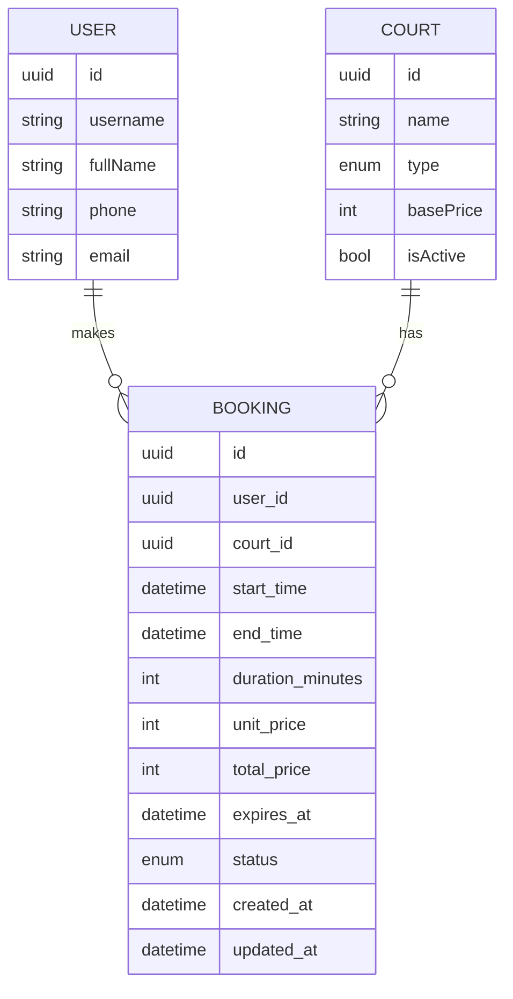
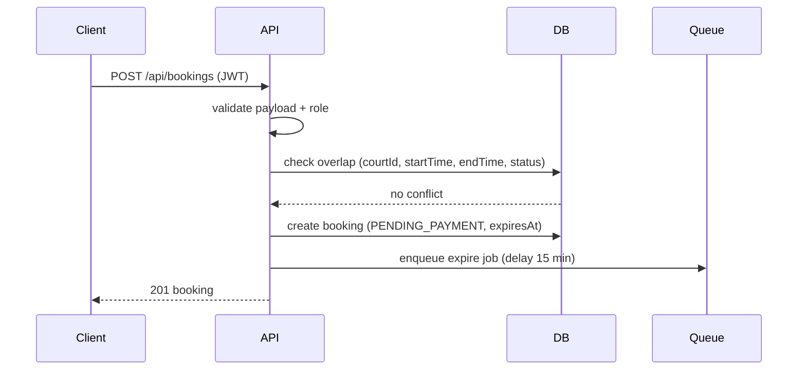

# Technical Design Document: Badminton Court Booking

## 1. Overview

This feature allows authenticated customers (role = CUSTOMER) to create a court booking from available-court search results. The system creates a booking with status PENDING_PAYMENT and automatically expires it after 15 minutes if unpaid. Operating hours are 06:00-23:00 with a 30-minute time step.

Scope: Create booking (POST /api/bookings). Excludes manual cancellation (CANCELED) and peak-hour pricing/owner feature in this TDD.

## 2. Requirements

### 2.1 Functional Requirements

- Logged-in customers can create a booking for an available court.
- The system re-checks availability (overlap) before creating the booking.
- The system only accepts bookings within 06:00-23:00 and on 30-minute boundaries.
- The system creates a booking with status PENDING_PAYMENT and expiresAt = createdAt + 15 minutes.
- The system automatically moves expired bookings to EXPIRED status after the payment window.
- The system calculates price based on court type (CourtType) and stores a price snapshot in the booking.

### 2.2 Non-Functional Requirements

- p95 latency for booking creation <= 300 ms.
- Security: only role = CUSTOMER can create bookings; apply rate limiting and audit logging.
- Reliability: do not retry booking creation on the server; safe retries are allowed for non-critical side-effects (metrics/logs/queue).
- Observability: logs and metrics for booking creation and auto-expiration.

## 3. Technical Design

### 3.1. Data Model Changes

Current Booking lacks a User reference and price/expiry fields. Add:

- Booking.userId -> User
- Booking.unitPrice, totalPrice, durationMinutes
- Booking.expiresAt
- Booking.status: add EXPIRED; rename CANCELLED -> CANCELED (if distinguishing manual cancel)

Updated ERD:



Proposed indexes:
- (courtId, startTime, endTime, status)
- (userId, createdAt)
- (expiresAt, status) for worker scanning

### 3.2. API Changes

**POST /api/bookings** (NEW)

- Auth: JWT, role = CUSTOMER
- Validation:
  - courtId valid
  - startTime < endTime
  - 30-minute step
  - within 06:00-23:00
  - durationMinutes within agreed min/max (see Open Questions)

**Request JSON**
```json
{
  "courtId": "uuid",
  "startTime": "2026-01-30T09:00:00.000Z",
  "endTime": "2026-01-30T10:30:00.000Z"
}
```

**Response JSON**
```json
{
  "id": "uuid",
  "courtId": "uuid",
  "userId": "uuid",
  "startTime": "2026-01-30T09:00:00.000Z",
  "endTime": "2026-01-30T10:30:00.000Z",
  "durationMinutes": 90,
  "unitPrice": 120000,
  "totalPrice": 180000,
  "status": "PENDING_PAYMENT",
  "expiresAt": "2026-01-30T09:15:00.000Z",
  "createdAt": "...",
  "updatedAt": "..."
}
```

Middleware stack:
- authenticate -> requireRole(CUSTOMER) -> validate(createBooking) -> controller -> service -> repo

Notes:
- Re-check overlap in service before creation (avoid race condition).
- Use a Prisma transaction for check + create.

### 3.3. UI Changes

- No UI changes required in this scope (owner/admin UI to be handled later).

### 3.4. Logic Flow

Sequence (create booking):



Worker (auto-expire):
- BullMQ worker receives expire job
- Re-check booking status = PENDING_PAYMENT and expiresAt <= now
- Update status -> EXPIRED

### 3.5. Dependencies

- Add Redis + BullMQ (worker/queue) for auto-cancel.
- .env:
  - REDIS_URL
  - BOOKING_EXPIRE_MINUTES=15

### 3.6. Security Considerations

- Only CUSTOMER can create bookings.
- Validate input with zod.
- Rate limit booking endpoint.
- Audit log booking creation (userId, courtId, time range).
- Minimize PII in logs (log userId only).

### 3.7. Performance and Reliability Considerations

- Overlap query is indexed and scoped to a single courtId.
- Transaction for check+create to reduce race conditions.
- Queue delay avoids heavy table scans.
- p95 <= 300 ms; monitor latency under DB load.

### 3.8. Observability and Operations

- Metrics:
  - bookings_created_total
  - bookings_create_latency_ms
  - bookings_expired_total
- Logs:
  - booking creation success/fail
  - worker expire actions
- Health:
  - queue/worker health metrics (BullMQ)

## 4. Testing Plan

- Unit tests: duration/price calculation, 30-minute step validation, operating hours.
- Integration: POST /api/bookings success + overlap conflict + invalid time.
- Worker tests: create PENDING_PAYMENT -> expire job -> status EXPIRED.
- Contract tests: response schema for client.

## 5. Open Questions

- What is the min/max booking duration?
- Peak-hour window/threshold for owner feature (out of scope for this TDD).
- Currency unit: VND or other?

## 6. Alternatives Considered

- Cron-based DB scan instead of delayed queue jobs: simpler but less precise and heavier on large tables.
- Allowing client retries for booking creation: rejected due to duplicate booking risk.
