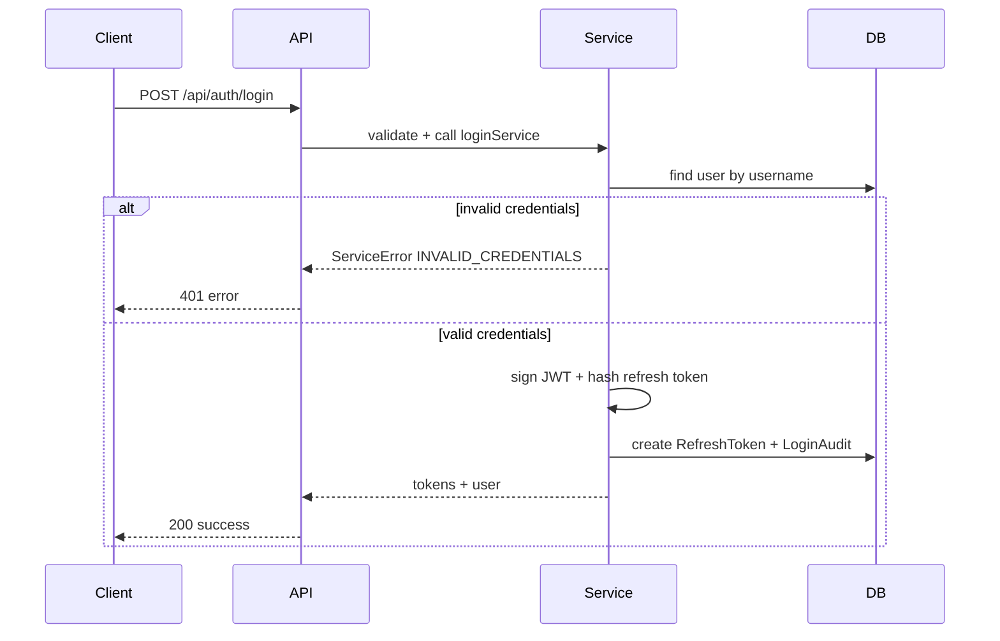

# Technical Design Document: Auth Login API

## 1. Overview

Provide a login API for users who have successfully registered, issuing access and refresh tokens aligned with the existing registration flow.

## 2. Requirements

### 2.1 Functional Requirements

- Allow login using username.
- Verify password using bcrypt.
- Issue access token and refresh token with JWT RS256.
- Store hashed refresh tokens in `RefreshToken`.
- Record login audits (success/failure).
- Return responses using `responseMiddleware` format.
- Apply rate limiting identical to registration.

### 2.2 Non-Functional Requirements

- Security: do not leak user existence on failed login; refresh tokens are stored hashed only.
- Performance: p95 login latency under 300ms.
- Observability: log `requestId` (if present), IP, userAgent; add metrics for login success/failure and latency.
- Rate limiting: use the same thresholds as registration.

## 3. Technical Design

### 3.1. Data Model Changes

- No new tables or structural changes.
- Add `LOGIN` to the `AuditAction` enum to record login audits.

### 3.2. API Changes

- **Endpoint:** `POST /api/auth/login`
- **Request Body:**
  ```json
  {
    "username": "string",
    "password": "string"
  }
  ```
- **Success Response:**
  ```json
  {
    "status": "success",
    "data": {
      "user": {
        "id": "string",
        "username": "string",
        "fullName": "string",
        "phone": "string",
        "email": "string",
        "role": "CUSTOMER"
      },
      "tokens": {
        "accessToken": "string",
        "refreshToken": "string"
      }
    }
  }
  ```
- **Error Response:**
  ```json
  {
    "status": "error",
    "code": "INVALID_CREDENTIALS",
    "message": "Invalid login credentials"
  }
  ```
- **Error Codes:**
  - `INVALID_CREDENTIALS`
  - `VALIDATION_ERROR`
  - `RATE_LIMITED`
  - `INTERNAL_ERROR`

### 3.3. UI Changes

- No UI changes.

### 3.4. Logic Flow

- Validate payload with Zod.
- Find user by username.
- If user not found or password mismatch, return `INVALID_CREDENTIALS` (do not reveal which).
- If valid:
  - Sign access token and refresh token.
  - Hash refresh token.
  - Persist refresh token.
  - Record login audit.
  - Return user + tokens.



### 3.5. Dependencies

- Reuse existing libraries:
  - `bcryptjs` (password verification)
  - `jsonwebtoken` (token signing)
  - `prisma` (DB access)
  - `zod` (validation)
  - `express-rate-limit` (rate limiting)
- No queue/OTP dependencies.

### 3.6. Security Considerations

- Hash refresh tokens before persisting.
- Always return `INVALID_CREDENTIALS` on auth failure to prevent user enumeration.
- Apply IP-based rate limiting.
- Never log passwords or tokens.
- Enforce JWT issuer and TTL via config.

### 3.7. Performance and Reliability Considerations

- Reuse Prisma connection pool.
- Keep queries minimal: 1 user lookup + 1 transaction for refresh token + audit.
- Target p95 < 300ms.
- Avoid retries on failed logins.

### 3.8. Observability and Operations

- Log `username` (masked if needed), `ip`, `userAgent`.
- Add metrics: `auth_login_success_total`, `auth_login_failure_total`, `auth_login_duration_ms`.
- Follow `docs/ops.md` for PII masking and TLS.

## 4. Testing Plan

- Unit tests: login service (happy path, invalid credentials, repo errors).
- Integration tests: `POST /api/auth/login` (200, 400, 401, 429, 500).
- Contract tests: OpenAPI schema for login endpoint.

## 5. Open Questions

- None.

## 6. Alternatives Considered

- Do not store refresh tokens: rejected due to lack of revocation support.
- Return `USER_NOT_FOUND` explicitly: rejected to avoid user enumeration.
