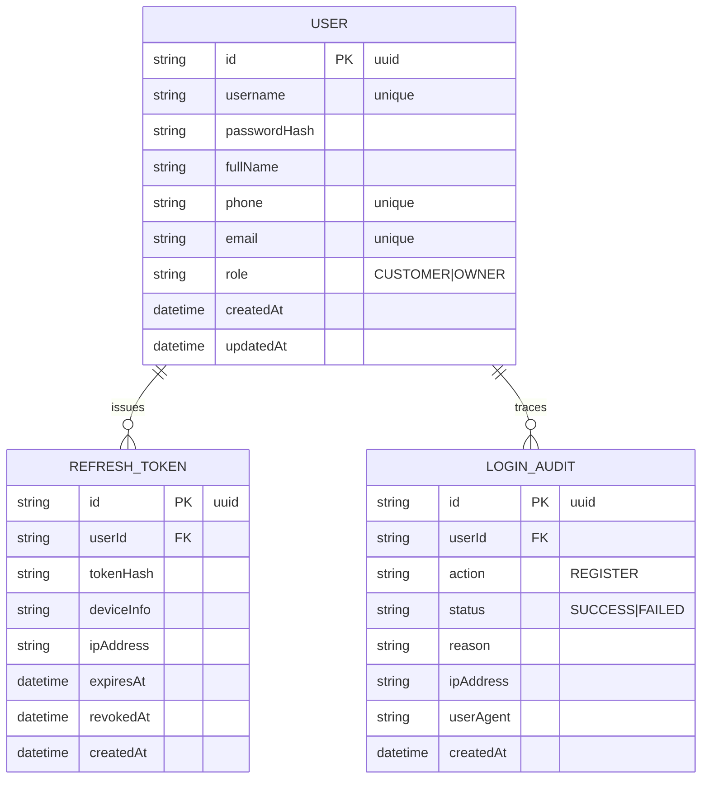
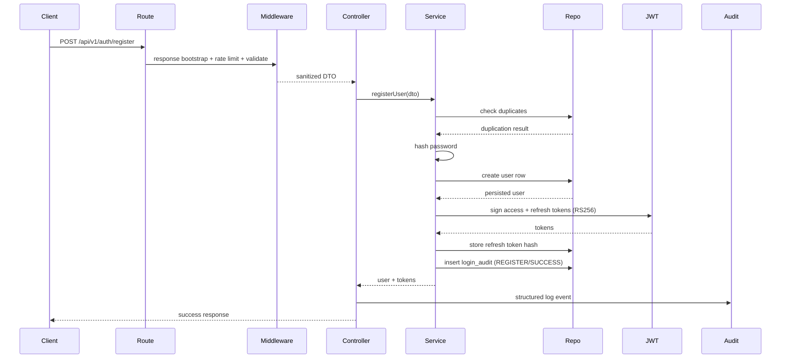

# Technical Design Document: User Registration

## 1. Overview
The SmartBadminton backend (Node.js + TypeScript, MVC skeleton in `backend/src`) needs a registration capability for both customer and owner actors from `docs/CNM (1).pdf`. The feature exposes `POST /api/v1/auth/register`, validates business rules, persists users via Prisma, issues asymmetric JWTs, records refresh tokens and audit logs, and enforces anti-spam rate limiting.

## 2. Requirements

### 2.1 Functional Requirements
- FR1: A customer or owner submits username, password, fullName, phone, email, role to create an account.
- FR2: Enforce validation rules (username length + uniqueness, phone = 10 digits + unique, email format + unique, fullName without numbers/special chars, password >=10 chars with uppercase).
- FR3: On success return sanitized user info plus `accessToken` and `refreshToken` following the standardized response envelope.
- FR4: Persist a hashed record in `refresh_tokens` and insert a `login_audit` entry with action REGISTER / status SUCCESS.
- FR5: Emit specific errors for duplication or invalid input (`USERNAME_TAKEN`, `PHONE_DUPLICATED`, etc.).
- FR6: Limit the endpoint to 5 requests per 15 minutes per IP.

### 2.2 Non-Functional Requirements
- NFR1: p95 latency <300 ms for <=50 req/s traffic.
- NFR2: Hash passwords with BCrypt (>=12 rounds). Sign JWT with RS256 using dedicated access/refresh key pairs.
- NFR3: Mask PII in logs; log requestId, ip, outcome for every attempt.
- NFR4: All controllers must send responses via shared helper ensuring `{status,data,error}` shape.
- NFR5: captcha/reCAPTCHA is out of scope but design must allow future middleware insertion.
- NFR6: Support baseline availability (99%) and avoid blocking the event loop.

## 3. Technical Design

### 3.1. Data Model Changes
Prisma schema (`backend/prisma/schema.prisma`) updates:



Implementation notes:
- `id` fields use `@id @default(uuid())`.
- `role` becomes Prisma enum (`CUSTOMER`, `OWNER`).
- Store only `passwordHash` and `tokenHash` (hash of refresh token). Plain values never persist.
- Create unique indices for username, phone, email, tokenHash.

### 3.2. API Changes
- Route: `POST /api/v1/auth/register` defined in `backend/src/routes/auth.routes.ts`.
- Middleware pipeline: response helper bootstrap → rate limit (express-rate-limit) → validation middleware (zod) → controller.
- Request body:
```json
{
  "username": "string(6-32, [A-Za-z0-9_])",
  "password": "string(>=10, contains uppercase)",
  "fullName": "letters + spaces",
  "phone": "10 digits",
  "email": "string",
  "role": "CUSTOMER" // or "OWNER"
}
```
- Success response follows shared structure:
```json
{
  "status": "success",
  "data": {
    "user": {
      "id": "uuid",
      "username": "...",
      "fullName": "...",
      "phone": "...",
      "email": "...",
      "role": "CUSTOMER"
    },
    "tokens": {
      "accessToken": "...",
      "refreshToken": "..."
    }
  }
}
```
- Error response example:
```json
{
  "status": "error",
  "code": "USERNAME_TAKEN",
  "message": "Username already exists"
}
```
- Headers: `Content-Type: application/json`. No auth header required.

### 3.3. UI Changes
No UI/backoffice work in scope. API contract will be documented for frontend/mobile teams.

### 3.4. Logic Flow
Module layout (all under `backend/src`):
- `routes/auth.routes.ts` registers the route and attaches middleware.
- `modules/auth/controllers/auth.controller.ts` handles request/response.
- `modules/auth/services/auth.service.ts` exposes `registerUser(dto)` with business rules.
- `modules/auth/repositories/user.repository.ts` wraps Prisma operations for users, refresh tokens, login audit.
- `modules/auth/validators/register.validator.ts` defines zod schema.
- Shared helpers: `shared/jwt.ts`, `shared/hash.ts`, `middleware/rateLimit.ts`, `middleware/response.ts`.

Sequence:


Failure branches:
- Validation middleware throws 400 with error payload.
- Repository detects duplicates → service throws 409 codes.
- Rate limiter returns 429 before reaching controller.
- Unexpected errors bubble to global error handler (500) and audit logged with FAILED reason.

### 3.5. Dependencies
- `express`, `express-rate-limit`.
- `zod` (or `joi`) for schema validation.
- `bcrypt`/`bcryptjs` for password hashing.
- `jose` or `jsonwebtoken` for RS256 JWT handling.
- `pino` or `winston` for logging.
- `prisma`, `@prisma/client` for data access.
- `dotenv` for config loading.
- Testing: `jest`, `ts-jest`, `supertest`, `jest-openapi` (or equivalent schema validator).

### 3.6. Security Considerations
- Store only hashed secrets (password, refresh token) and never log raw values.
- Use RS256 with environment-provided private/public keys (`JWT_ACCESS_PRIVATE_KEY`, etc.).
- Rate limit 5 req / 15 min per IP; provide reset hook for tests.
- Validation rejects malicious input; sanitize output before returning to client.
- Force HTTPS at deployment level; set `Secure`/`HttpOnly` flags if tokens ever move to cookies (not planned now).
- Log attempts with masked identifiers (e.g., show last 2 digits of phone only).

### 3.7. Performance and Reliability Considerations
- Prisma connection pooling sized via `DATABASE_URL` parameters.
- BCrypt hashing and JWT signing executed asynchronously.
- Rate limiter uses in-memory store for dev, Redis store in prod (configurable via env).
- Service layer is stateless, enabling horizontal scaling; refresh tokens stored for revocation.
- Add graceful shutdown hooks to flush logs and close Prisma connections.

### 3.8. Observability and Operations
- Logging middleware attaches `requestId`; controller logs `register_attempt` with status.
- Metrics counters: `auth_registration_success_total`, `auth_registration_failure_total`, `auth_registration_ratelimit_total` (via prom-client or OpenTelemetry).
- Expose histogram `auth_registration_latency_ms` to monitor SLA.
- Alert if failure ratio >5% over rolling 5 minutes.
- CI/CD: lint, test, Prisma migrate diff, Docker build (using infra scripts). Document env vars in `README` or `docs/setup.md`.

## 4. Testing Plan
- Unit Tests (Jest): cover `auth.service` (duplicate detection, hashing, JWT invocation) and validation utilities. Mock Prisma and JWT libs.
- Integration Tests (Jest + Supertest): spin up Express app with test Prisma DB (SQLite). Cover happy path, duplicate username/email/phone, invalid payload, rate limit exhaustion, DB failure.
- API Contract Tests: validate success + error responses against OpenAPI/JSON schema (stored under `docs/api/auth.yaml`). Use `jest-openapi` or `supertest` + schema matcher.

## 5. Open Questions
- None currently. Future considerations: device binding for refresh tokens, captcha integration timeline.

## 6. Alternatives Considered
- Email/OTP verification at signup was deferred to keep v1 lightweight and reduce latency.
- HS256 JWT with shared secret was rejected to avoid sharing symmetric secrets across services and to support multi-service verification later.
- Storing refresh tokens in plaintext was rejected for security reasons; hashing mitigates leakage risk.
